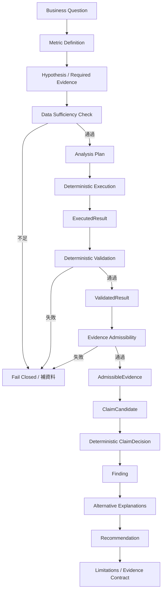

# CommerceLens 專案目標、成果與 Roadmap

**基準日期：** 2026-09-01
**目前基線：** P7-001 **APPROVED / FROZEN**
**核准實作 HEAD：** `f48b75eb0f67f5b14675886e6ce1749835d2dc16`
**最終 main 治理 HEAD：** `35a170e322fe64a576c764a0c99abb9714b367d9`
**驗證紀錄：** Python 3.11.9；DuckDB 1.5.5；pytest 8.4.2；MetadataStore schema v5；完整測試套件 398 passed；獨立 final verification 通過；Main Project final source review 通過；三類已知 P7 blocker 已關閉；治理整合完成；無 Frozen 或 dependency drift
**本文件用途：** 統一說明專案目標、已完成成果、固定流程、成功準則、OSS reuse 邊界，以及 P7 之後的建議 roadmap。

---

## 1. Executive Summary

CommerceLens 的目標不是再做一個「把資料丟給 LLM、產生圖表與文字摘要」的通用分析工具，而是建立一套可被查核、可重現、會在證據不足時拒絕過度結論的電商決策系統。

核心原則是：

> **No material claim without traceable evidence.**
> 任何會影響商業決策的重要主張，都必須有可追溯、可驗證、可重現的證據。

截至 P7，CommerceLens 已完成第一個可運作的 **Evidence Reliability Kernel（證據可靠性核心）**：從資料註冊、canonicalization、metric authority、資料充分性、deterministic execution、validation，一直到 evidence admissibility，已針對 Revenue、Orders、AOV、Revenue Change 四個指標形成完整且 fail-closed 的垂直鏈路。

但目前完成的是「可靠性核心」，還不是完整終端產品。ClaimDecision、Findings、Alternative Explanations、Recommendations、實體 fixture runner、Skill/host adapter、API/CLI、UI，以及 Decision Reliability Benchmark 尚未完成。

因此，最準確的專案狀態是：

- **規格與治理基線：完成。**
- **資料到 admissible evidence 的第一版核心：完成，範圍限四個指標。**
- **從 evidence 到可交付商業決策的產品層：尚未完成。**
- **WrenAI 等 OSS：持續評估 execution infrastructure reuse，但不取代 CommerceLens 的 evidence governance。**

---

## 2. 專案最終目標

### 2.1 使用者問題

電商團隊通常不缺圖表，而是缺少一個能回答下列問題、同時說清楚證據與限制的系統：

- 營收為什麼變動？
- 是訂單量、客單價、產品組合、折扣、退款或資料缺漏造成？
- 哪些結論已被資料支持，哪些只是可能解釋？
- 哪些建議可以採取，哪些應先補資料或做實驗？
- 同一份資料再次分析時，結果能否一致重現？

一般聊天式分析容易把「查詢成功」當成「答案正確」，再把「數字正確」當成「結論成立」。CommerceLens 要明確分離這三件事：

1. **Numerically faithful result**：數值在運算與型別轉換中沒有失真。
2. **Analytically valid result**：結果符合指標定義、資料範圍與驗證規則。
3. **Admissible evidence**：結果具備足夠 lineage、validation 與治理條件，可以支持特定主張。

### 2.2 最後完成品的構成

完整 CommerceLens 不是單一聊天機器人，而是三層 canonical product architecture。Frozen architecture 的產品層順序仍是 Skill → Engine → Benchmark；目前實作先建立 engine foundation，是 implementation sequence 的選擇，不重新定義產品層：

| 層級 | 目標完成品 | 主要價值 | 目前狀態 |
|---|---|---|---|
| 1 | **CommerceLens Skill / Evidence-first Agent** | 將商業問題轉成受治理的分析流程，產生 findings、限制、替代解釋與建議 | 尚未完成 |
| 2 | **Reusable Deterministic Analytics Engine / Evidence Reliability Kernel** | 將資料、metric、execution、validation、evidence 串成可重現且 fail-closed 的核心 | P7 已完成第一版垂直切片 |
| 3 | **Decision Reliability Benchmark** | 系統化比較不同 AI/分析流程在正確性、過度主張、證據完整性與重現性上的表現 | 後期目標，尚未開始 |

目前 implementation sequence 則是：Evidence Reliability Kernel foundation first → Claim governance → product / Skill layer → benchmark productization。這個順序合法地反映工程風險與 maturity，但不改寫 Frozen canonical layer order。

最終使用者體驗應是：使用者提供 CSV、Excel 或 SQLite 資料並提出電商問題，CommerceLens 先判定 metric 與 required evidence，再檢查資料是否足夠；只有通過 execution、validation 和 admissibility 的結果才能成為 finding，最後才生成受到證據約束的建議與清楚的 limitations。

---

## 3. 已定下且不可任意跳過的流程

完整 governed analyst lifecycle 如下。這是不可跳過的治理流程，不是只給 executive summary 使用的壓縮圖：

P7 已實作到 `AdmissibleEvidence`；圖中的 `ClaimCandidate`、`ClaimDecision`、`Finding`、`Alternative Explanations`、`Recommendation` 與 `Limitations / Evidence Contract` 是後續產品治理層。責任邊界必須保留：engine 產生 deterministic execution、validation 與 admissible evidence；claim governance 決定 material claim permission；product / Skill layer 組織可交付敘事與互動，但不得繞過 deterministic gates。

### 3.1 狀態必須分離

CommerceLens 不允許以下狀態被混為一談：

- Request 已建立，不代表資料足夠。
- ExecutionPlan 已授權，不代表已執行。
- ExecutedResult 存在，不代表結果有效。
- ValidatedResult 通過，不代表可支持所有類型的主張。
- AdmissibleEvidence 存在，不代表系統可自由推導因果或處方性建議。
- `ExecutedResult ≠ ValidatedResult`。
- `ValidatedResult ≠ AdmissibleEvidence`。
- `AdmissibleEvidence ≠ ClaimDecision`。
- `ClaimDecision ≠ Finding`。

### 3.2 Fail-closed 原則

只要 scope、currency、period、dependency lineage、semantic fingerprint、validation lineage 或 required evidence 不一致，系統必須停止，不得以「看起來合理」的方式繼續產生結論。

### 3.3 Deterministic 與 LLM 的邊界

- Deterministic core 負責：資料正規化、指標定義、授權、運算、驗證、lineage、證據資格。
- LLM/agent 未來可負責：理解問題、組織敘事、提出候選假設、解釋限制與互動。
- LLM 不得自行改寫 metric semantics、繞過 data sufficiency、偽造 validation 或將不合格結果包裝為 evidence。

---

## 4. 已完成的規格與治理成果

專案已建立八份 frozen authority documents，作為後續實作與審查的權威基線：

| 文件 | 作用 | 完成意義 |
|---|---|---|
| Project Master Instructions v1.1 | 專案總原則、決策與變更方式 | 防止開發過程任意改變產品本質 |
| PRD v1.1 | 使用者問題、MVP、成功準則 | 定義產品要解決的真實問題 |
| Skill-first Migration Strategy v1.1 | Skill、engine、benchmark 的演進路徑 | 避免一次建造三套產品 |
| Skill Scope v1.0 | Skill 應做與不應做的事 | 固定 agent 與 deterministic core 邊界 |
| Evidence Contract v1.0 | evidence、claim、lineage、admissibility 規範 | 建立 CommerceLens 核心差異化 |
| Canonical Dataset + Metric Dictionary v1.0 | canonical schema 與指標權威 | 防止同一指標多種算法漂移 |
| Evaluation Fixtures v1.0 | 測試案例與預期結果規格 | 讓正確性可驗證而非憑感覺 |
| Architecture v1.0 | 分層、元件與實作順序 | 固定可演進且可替換的架構 |

這八份文件完成的不是文件工作本身，而是把「什麼算正確、誰有權定義 metric、何時必須拒絕、哪些 evidence 可以支持哪些 claim」轉成可執行的工程約束。

---

## 5. P1–P7 已完成成果

### 5.1 進度總表

| 階段 | 已完成範圍 | 主要成果 | 驗證狀態 |
|---|---|---|---|
| P1–P2 | Repository、typed contracts、資料註冊、inspection、canonicalization、provenance、eligibility、currency/period/coverage、DQ、Data Sufficiency foundation | 建立安全資料入口與 canonical authority；來源保持 immutable | Approved / Frozen |
| P3-001 | Metric Registry、Governed Populations、Data Sufficiency gating、ExecutionPlan | 只有符合 metric 與 evidence 要求的分析鏈才會被授權 | 161 passed；Approved / Frozen |
| P4-001 | Revenue、Orders、AOV deterministic DuckDB execution | ExecutionPlan 可產生 ExecutionRecord 與 ExecutedResult | 198 passed；Approved / Frozen |
| P5-001 | Revenue、Orders、AOV deterministic validation | 每個 required rule 都有紀錄，並形成 ValidatedResult；可偵測 tamper | 227 passed；Approved / Frozen |
| P6-001 | Revenue、Orders、AOV evidence admissibility | 形成 EvidenceAdmissibilityRecord 與 immutable AdmissibleEvidence | 301 passed；Approved / Frozen |
| P7-001 | Revenue Change 完整垂直切片 | period dependency、Decimal arithmetic、validation、admissibility 與 lineage 全部打通 | **398 passed；獨立 final verification 通過；Main Project final source review 通過；APPROVED / FROZEN** |

### 5.2 P1–P2：資料與合約基礎

已完成：

- Typed contracts 與穩定 ID / SHA-256 identity。
- 安全 artifact store 與 SQLite metadata persistence。
- CSV、Excel、SQLite 的 read-only inspection。
- 原始來源 immutable；不接受靜默改寫。
- Mapping、canonical schema、canonicalization 與 provenance。
- Monetary value 使用 Decimal 正規化。
- Order-line identity 與 product authority。
- 無法分類的資料落入明確的 `Unclassified`，不得私自猜測。
- Eligibility、currency、period、coverage、data quality 與 per-chain Data Sufficiency。
- MetadataStore foundation、persistence foundation 與 migration discipline；目前專案狀態在後續階段完成到 schema v5。

成果意義：在執行任何 metric 前，資料的來源、欄位映射、時間、幣別與適用範圍已能被機器判定與追蹤。

### 5.3 P3：從「可算」變成「被授權後才可算」

P3 建立 Metric Registry、Governed Population 與 ExecutionPlan。這一階段不執行 SQL，而是回答：

- 這個 metric 的 authoritative definition 是什麼？
- 需要哪些資料與 population？
- 資料是否足夠？
- 此次 request 的 scope 是否允許產生 execution plan？

成果意義：execution 不是自由行為，而是受 metric authority 與 sufficiency gating 約束的行為。

### 5.4 P4：Deterministic Reference Execution

P4 讓 Revenue、Orders、AOV 透過 DuckDB 進入正式 execution chain，產生可持久化且可追溯的 ExecutionRecord 與 ExecutedResult。

成果意義：相同核准輸入與定義可得到可重現結果；查詢引擎只負責執行，不取得證據治理權。

### 5.5 P5：Deterministic Result Validation

P5 為每個 metric 建立 required validation rules，規定每一條 required rule 都必須留下 ValidationRecord，通過後才形成 ValidatedResult。同時加入 tamper detection。

成果意義：`query succeeded` 不再等於 `result is valid`。

### 5.6 P6：Narrow Evidence Admissibility

P6 將 Revenue、Orders、AOV 的 ValidatedResult 進一步判定為可接受或不可接受的 evidence，形成 EvidenceAdmissibilityRecord 與 AdmissibleEvidence。AOV 在分母為零等情況下可形成明確的 `Undefined` metric state，而不是製造錯誤數字。

成果意義：`validated number` 不再自動等於 `evidence for any claim`。

### 5.7 P7：Revenue Change Vertical Metric Slice

P7 將 `revenue_change` 從 metric registry 一路完成到 admissible evidence，並補上比單期指標更複雜的 dependency 與 period lineage。

已驗證內容包括：

- 正向、負向、零變化與零期間情境。
- 高精度 Decimal arithmetic。
- hostile ambient Decimal context 下仍維持 authoritative arithmetic。
- 當期與前期 validated revenue dependency 的完整 lineage。
- currency 與 scope 一致性。
- 即使攻擊者重新計算 semantic fingerprint，獨立 arithmetic validation 仍可抓出被竄改的 Revenue Change。
- execution-stage 與 validation-stage lineage tamper 均 fail closed。
- 合法的 scoped USD Revenue Change 可完成 execution、validation 與 admission；不相容 scope 被阻擋。
- P7 evidence 以 descriptive `metric_value` 形式保存完整 lineage。

P7 刻意不包含 Revenue Change %、ClaimDecision、Findings、Recommendations、Contribution、ranking、MCP、Wren 或外部 executor。這是受控範圍，不是遺漏。

---

## 6. 目前真正可用的能力

目前 engine 能對核准資料與 scope 完成下列四個 authoritative metrics：

| Metric | Execution | Validation | Evidence admissibility | 備註 |
|---|---:|---:|---:|---|
| Revenue | 已完成 | 已完成 | 已完成 | Decimal monetary semantics |
| Orders | 已完成 | 已完成 | 已完成 | authoritative order population |
| AOV | 已完成 | 已完成 | 已完成 | 支援 Undefined state |
| Revenue Change | 已完成 | 已完成 | 已完成 | 具 period dependencies 與獨立 arithmetic validation |

目前能保證的是：在已支援的輸入、metric 與 scope 中，結果經過受治理的 deterministic chain，且 lineage 或語義遭竄改時會拒絕繼續。

目前不能宣稱的是：系統已能對任何電商資料、任何商業問題，自動產生完整、正確的 root cause、finding 或 recommendation。

---

## 7. 成功準則

### 7.1 Kernel 成功準則

對每個正式支援的 metric，必須同時滿足：

1. **Metric authority**：定義、population、currency、period、scope 與 undefined state 明確且版本化。
2. **Data sufficiency**：執行前判定 required evidence 是否存在，不足即 fail closed。
3. **Determinism**：相同核准輸入、版本與 scope 產生一致結果。
4. **Precision fidelity**：monetary arithmetic 不得靜默失真。
5. **Validation completeness**：每條 required validation rule 都有持久化紀錄。
6. **Tamper resistance**：execution、semantic、dependency、validation lineage 被修改時可被偵測。
7. **Evidence admissibility**：只有符合 Evidence Contract 的結果可成為 AdmissibleEvidence。
8. **Reproducibility**：從 evidence 可回溯到 request、source、mapping、plan、execution、validation 與版本。

### 7.2 Technical MVP 產品成功準則

Technical MVP completion 評估的是產品能力是否已被建成並驗證，不包含 willingness-to-pay 或市場採用已被證明。完整 Technical MVP 必須達成：

- 100% material claims 可追溯到 admissible evidence。
- 100% 使用到的 metrics 先有 authoritative definition。
- 100% 分析鏈在 execution 前執行 Data Sufficiency 檢查。
- 100% 未被 evidence 支持的 strong claims 被阻擋或降級。
- 每個 claim 都有類型、狀態、支持 evidence 與 limitations。
- execution 或 validation 失敗的結果不得進入 findings。
- recommendations 必須連結到已核准 findings，並明列假設與風險。
- 所有 authoritative fixtures 在支援的 source formats 上通過。
- 使用者能檢視「答案、證據、限制、替代解釋」而不只看到生成文字。

### 7.3 Solution Validation 成功準則

Solution Validation 是 Technical MVP 之外的市場與產品 thesis gate；目前尚未通過。現有市場結論保持 **CONDITIONAL GO**：問題值得解，但仍需證明使用者願意為 evidence governance 付出額外等待、限制或成本。

建議用三組 head-to-head experiment 驗證：

1. Generic AI analyst。
2. 只有 semantic governance 的 AI analyst。
3. CommerceLens evidence-governed workflow。

需要量測：

- 錯誤率與 overclaim rate 是否顯著降低。
- 使用者是否更能識別答案來源與限制。
- 在被系統拒絕或要求補資料時，使用者是否仍認為產品有價值。
- 準確性提升是否足以抵銷 latency、設定與維護成本。
- 最適合付費的 buyer 是 analyst、e-commerce operator、agency 還是 data/AI governance owner。

量化門檻應由未來 evaluation protocol 正式核准，不應在尚未測試前任意宣告。

---

## 8. 最新競品與 OSS Reuse 對 Roadmap 的影響

### 8.1 Executive decision

**Roadmap 不變：積極 reuse 已被證明的 commodity execution infrastructure，但不外包 CommerceLens 的 analytical governance。**

### 8.2 WrenAI

以下為本文件既有研究日期下的 evidence snapshot，不代表本次 reconciliation 新增 web research。最新監測顯示 WrenAI 的 semantic execution、relationship resolution、upgrade validation 與 decimal fidelity 證據持續增強；官方 release 頁也顯示 `wren-semantic-core-v0.3.2` 與 `wren-core-py-v0.7.6` 於 2026-08-31 發布。WrenAI 因此繼續是最值得監測的 deterministic analytics foundation candidate。[WrenAI repository](https://github.com/Canner/WrenAI)；[WrenAI releases](https://github.com/canner/WrenAI/releases)

但專案先前的 R-001 feasibility 結論仍是：

- **Production authority 保持 DuckDB。**
- WrenAI 尚未被採用。
- 最新監測的 `Foundation Candidate` 身分不等於自動重開 adoption。
- 若要重新評估，必須另開 narrowly scoped、可逆、具 fixture 的 authorization gate。

若未來 feasibility 通過，可考慮 reuse：

- semantic metric compilation。
- relationship resolution。
- SQL dialect execution 與 connector normalization。
- Arrow result representation。
- monetary precision handling。

仍不能交給 WrenAI 的部分：

- Metric authority 與 canonical e-commerce semantics。
- Required Evidence 與 Data Sufficiency Contract。
- CommerceLens validation rules。
- claim classification / admissibility。
- Alternative Explanations 與 recommendation governance。
- Evidence Contract 與 authoritative Evaluation Fixtures。

### 8.3 DB-GPT v0.8.2

以下同樣保留為既有 evidence snapshot。DB-GPT v0.8.2 改善 multi-file / Excel analysis、execution handling 與先前記錄的 security concerns，因此可從「暫不評估 execution reuse」恢復為「持續觀察」。不過其 agent/RAG/framework dependency surface 仍大，且沒有證據顯示能提供 CommerceLens-grade evidence governance。因此 disposition 維持 **REFERENCE**，不是 foundation candidate，也不做 integration spike。[DB-GPT releases](https://github.com/eosphoros-ai/DB-GPT/releases)

### 8.4 目前 reuse / build 邊界

| 可優先 reuse / adapt | CommerceLens 必須自行擁有 |
|---|---|
| DuckDB 執行引擎 | Metric Dictionary authority |
| CSV / Excel / SQLite parsers | Canonical e-commerce semantics |
| openpyxl、Pydantic、PyYAML 等成熟元件 | Required Evidence / Data Sufficiency |
| SQL dialect、connector、Arrow normalization（通過 feasibility 後） | Deterministic validation orchestration |
| 通用 chart / export renderer | Evidence Contract / admissibility |
| 可隔離的 sandbox 或 ingestion component | ClaimDecision、Alternative Explanations、Recommendations |
| 通用 Skill host / adapter protocol | Authoritative fixtures 與 benchmark protocol |

判斷原則：如果元件只負責「把已授權的工作可靠執行」，可以評估 reuse；如果元件會決定「什麼數字成立、什麼結論能說、什麼建議可採用」，CommerceLens 必須保留權威。

---

## 9. 尚未完成的目標與功能

### 9.1 Metric 與分析能力

- Revenue Change %，包含前期為零時的 Undefined semantics。
- Product / Category revenue、orders、change 與 performance。
- Contribution absolute、share 與 ranking。
- 更完整的 period comparison 與 segment/entity union。
- Refund、discount、gross margin 等未來 metrics；需先定義 authoritative semantics 與 required evidence。

### 9.2 Evidence 到 Decision 的治理層

- ClaimDecision。
- claim type 與支持強度判定。
- Findings artifact。
- Alternative Explanations governance。
- Recommendations 與 limitations contract。
- 從 descriptive evidence 到 diagnostic / prescriptive claim 的升級規則。

### 9.3 評估與可靠性

- 實體 YAML / CSV authoritative fixtures。
- Fixture runner、expected-output comparator 與 source-format conformance。
- 全鏈 end-to-end evaluation corpus。
- Generic AI、semantic-only、CommerceLens 三組對照實驗。
- Decision Reliability Benchmark 與 scoring protocol。

### 9.4 產品與整合

- 穩定的 in-process application API。
- Thin CLI。
- 正式 `SKILL.md`、host adapter 與 LLM orchestration。
- 完整 end-to-end Skill workflow。
- 最小 UI / demo：問題、資料充分性、結果、證據、限制、替代解釋與建議。
- 可選的 connector expansion；目前不應以大量 connector 數量取代治理層工作。

### 9.5 明確延後或不在 MVP

- 自由形式 predictive forecasting。
- 自動因果推論。
- 無治理的任意 Python execution。
- A/B testing platform。
- 大型 dashboard suite。
- 在 evidence chain 尚未完成前建立華麗 UI。

---

## 10. P7 之後的建議 Roadmap

下列是**建議順序，不是已核准的 task specification**。這些是 roadmap stage labels；每一階段仍需自己的 narrow task specification、authorization gate、acceptance criteria 與 fixture，才可進入實作。

| 建議階段 | 目標 | 主要交付成果 | Exit / 成功準則 |
|---|---|---|---|
| R0-lite：Roadmap / README factual reconciliation | 修正 post-P7 文件事實落差 | Roadmap factual reconciliation；README factual reconciliation if required；narrowly identified stale non-Frozen project-status documentation | 文件一致反映 P7 APPROVED / FROZEN、四項 metrics、398 tests；PROJECT_STATE 不被修改；protected authority 不被未授權修改 |
| P8：ClaimDecision Foundation | 從 admissible evidence 進入 deterministic material claim permission | ClaimDecision contract、claim type / strength classification、support mapping、refusal / downgrade rules、required qualifications | numerically correct 但 evidence 或 claim strength 不足的 material claim 被阻擋或降級 |
| P9：Minimum Physical Fixture Runner | 建立最小 executable fixture layer | YAML / small CSV fixture loading、runner、expected-output comparator、source-format conformance skeleton | fixture 可同時驗證 numerical / evidence correctness 與 Claim admissibility / Claim strength correctness |
| P10：Revenue Change Percentage Vertical Slice | 完成 governed Revenue Change Percentage metric | Registry、plan、dependency execution、Decimal validation、Undefined semantics、admissibility | governed Baseline Revenue 與 Comparison Revenue 被正確引用；Baseline Revenue = 0 時產生 governed Undefined semantics |
| P11：Entity Performance Foundation | 建立 Product / Category governed populations | Entity union、product/category Revenue、Orders、Change foundations | 不重複計算；Unclassified 與 scope semantics 一致 |
| P12：Contribution and Ranking | 支援組合與排序分析 | Contribution absolute/share、ranking artifacts | 分母、ties、missing entity、scope 均有 deterministic rules |
| P13：Findings and Alternative Explanations | 建立可交付分析結果 | Findings artifact、Alternative Explanations、limitations | 每個 finding 可追溯；observed fact、hypothesis 與 alternative explanation 明確分離 |
| P14：Recommendation Governance | 建立受證據約束的行動建議 | Recommendation artifact、assumptions、risk、next evidence | recommendation 只引用核准 findings；不可把相關性說成因果 |
| P15：Application Boundary | 提供穩定產品介面 | In-process API、thin CLI、artifact retrieval | 可用單一受控 workflow 重跑並取得相同 artifacts |
| P16：CommerceLens Skill / Evidence-first Agent | 完成 evidence-first agent 體驗 | SKILL.md、host adapter、LLM orchestration、end-to-end flow | LLM 無法繞過 deterministic gates；使用者看得到拒絕原因與限制 |
| P17：Minimal Demo / UI | 對外呈現完整價值 | 資料上傳、問題、evidence view、findings、recommendations | 端到端任務可由目標使用者完成，且 evidence lineage 可檢視 |
| P18：Solution Validation | 驗證市場與差異化 | 三組 head-to-head study、錯誤/overclaim/信任/latency 結果 | 評估 CommerceLens 相對 baseline 的可量測增益，再決定擴張 |
| Later：Decision Reliability Benchmark productization | 產品化評估能力 | 公開/私有 evaluation suites、scoring、comparison reports | protocol 穩定、可重現，且不與 MVP 核心爭奪資源 |

### 建議的近期優先順序

1. 先完成 R0-lite 文件 factual reconciliation；PROJECT_STATE 已由 `35a170e322fe64a576c764a0c99abb9714b367d9` 完成治理整合，本階段不修改 PROJECT_STATE。
2. P8 優先做 ClaimDecision Foundation，因為 CommerceLens 已有 Revenue、Orders、AOV、Revenue Change 的 deterministic Evidence chains，但還缺少從 `AdmissibleEvidence` 到 deterministic material Claim permission 的核心治理層。
3. P9 立即建立 minimum physical fixture runner；一旦 ClaimDecision 存在，fixtures 就能同時驗證 numerical / evidence correctness 與 Claim admissibility / Claim strength correctness。
4. P10 再做 Revenue Change Percentage vertical slice。Revenue Change Percentage 增加 metric breadth，但其語義依賴 governed Baseline Revenue 與 Comparison Revenue；Baseline Revenue = 0 必須產生 governed Undefined semantics。
5. WrenAI 保持 monitoring / foundation candidate；除非另開 feasibility gate，不改動目前 DuckDB production authority。

P8 選擇 ClaimDecision 的原因是：數值正確的結果不會自動授權 material claim。Revenue Change Percentage 能增加 Metric breadth，但 ClaimDecision 關閉的是目前更中心的產品缺口：`AdmissibleEvidence → deterministic material Claim permission`。這是基於 analytical correctness、evidence governance、目前 implementation maturity 與 remaining MVP gap 的 approved current development strategy；不宣稱此 sequencing 已被外部市場證明。

P9 的 minimum physical fixture runner 必須緊接 ClaimDecision，因為 executable fixtures 應同時檢查：A. numerical / evidence correctness；B. Claim admissibility / Claim strength correctness。即使數字正確，若 formula、population、lineage、evidence admissibility、Claim type / strength 或 required qualification 任一不成立，答案仍可能 fail。

P10 的 Revenue Change Percentage 仍保留為受治理 metric：它依賴 governed Baseline Revenue 與 Comparison Revenue；Baseline Revenue = 0 時不得產生偽精確 percentage，而必須走 governed Undefined semantics。

## 11. 目前進度的正確解讀

### 已完成

- 八份治理與架構 authority documents。
- 安全資料註冊、inspection、canonicalization、provenance 與 sufficiency foundation。
- Revenue、Orders、AOV、Revenue Change 的完整 deterministic evidence chain。
- 對 scope、currency、period、dependency、semantic 與 validation lineage 的 fail-closed 防護。
- MetadataStore v5 與 immutable evidence artifacts。
- P7 最終全套 398 tests、獨立 final verification 與 Main Project final source review。
- Wren R-001 第一輪 feasibility；結論為保留 DuckDB，不採用 Wren。

### 尚未完成

- Evidence 到 ClaimDecision、Finding、Recommendation 的核心產品價值閉環。
- 實體 evaluation fixtures 與 head-to-head validation。
- Skill、LLM host integration、API/CLI、UI/demo。
- 更多電商 metrics 與 entity/contribution analysis。
- Benchmark 產品化。

### 不應使用單一百分比表示的原因

P1–P7 是連續工程階段，但後續產品層的總 task 數尚未正式核准，因此不能誠實地把 P7 說成「整個專案完成 70%」之類的數字。較準確的說法是：

- **第一版 Evidence Reliability Kernel：已完成四項 metric 的可驗證垂直切片。**
- **完整 CommerceLens MVP：尚未完成，主要缺口在 decision governance 與 product delivery。**
- **Decision Reliability Benchmark：尚未開始。**

---

## 12. 下一個決策 Gate

下一步不應直接大規模開發，也不應開始 P8 實作本身。下一個 narrow task 應是核准 P8 ClaimDecision Foundation 的 task specification：明確定義 ClaimCandidate、ClaimDecision、claim type / strength、support mapping、refusal / downgrade rules、required qualification 與 fixtures。

Revenue Change Percentage 改列 P10；Minimum Physical Fixture Runner 改列 P9。這移除了先前 metric-breadth option 與 fixture-first option 之間的衝突，並保留核心治理原則：a numerically correct result does not automatically authorize a material claim。

WrenAI 保持 monitoring / foundation candidate；除非另開 feasibility gate，不改動目前 DuckDB production path。

---

## 13. 專案完成定義

CommerceLens Technical MVP 只有在以下產品與工程條件全部成立時，才應稱為「完成」：

1. 支援的核心電商 metrics 均有 authoritative definition、execution、validation、admissibility 與 fixtures。
2. Business Question 可被轉成 required evidence 與受治理的 analysis plan。
3. 不足資料、衝突 scope、invalid lineage 或 failed validation 必定 fail closed。
4. AdmissibleEvidence 可形成 ClaimDecision；ClaimDecision 再形成 Finding，但二者不得合併為同一 lifecycle state。
5. Alternative Explanations、limitations 與 recommendations 有正式 artifact 與 governance。
6. Skill/agent 只能呼叫已核准 deterministic interfaces，不能自行創造 metric 或 evidence。
7. 使用者可透過 API/CLI 或 minimal UI 完成端到端任務並查看證據鏈。
8. Authoritative fixtures 與 end-to-end workflow 全數通過。

Solution Validation 是獨立 gate，不是 Technical MVP 的前置條件，也尚未通過。它應評估 CommerceLens 是否創造足夠 real-world value，包括 error reduction、overclaim reduction、trust / traceability、user tolerance for refusal、latency、setup / maintenance burden、target buyer、willingness to pay，以及相對 generic 或 semantic-only AI analytics 的 incremental value。

在此之前，對外最準確的定位是：

> **CommerceLens 已完成 P7-001 APPROVED / FROZEN 的 evidence reliability kernel 基線，正在從可信數值引擎走向完整的 evidence-governed e-commerce decision product。**
