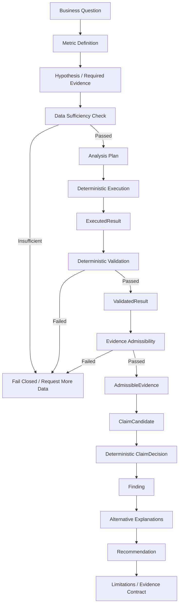

# CommerceLens Project Goals, Accomplishments, and Roadmap

> Language: English canonical version.
> Traditional Chinese version: `COMMERCE_LENS_PROJECT_GOALS_AND_ROADMAP_P7_2026-09-01.zh-TW.md`

**Baseline date:** 2026-09-01
**Current baseline:** P8-001 **APPROVED / FROZEN**
**Approved implementation HEAD:** `fff3229d03e5e122cb62aa8105f1c0d8f28021b2`
**Final main governance HEAD:** `9af5b7b8534b5fbab46c5bcc812316839d400051`
**Verification record:** Python 3.11.9; DuckDB 1.5.5; pytest 8.4.2; MetadataStore schema v6; full test suite 455 passed; P8 final Main Project hostile source review passed; P8 ClaimDecision Foundation **APPROVED / FROZEN**; governance integration complete; no Frozen or dependency drift.

**Purpose of this document:** Provide a unified public-facing record of CommerceLens project goals, completed work, fixed governance flow, success criteria, OSS reuse boundaries, and the narrow post-P8 roadmap amendment for the fastest evidence-governed public v0.1 Skill.

---

## 1. Executive Summary

CommerceLens is not a generic "chat with CSV" tool. It is an evidence-governed analytics system for structured business data. Its core principle is:

> **No material claim without traceable evidence.**

The project exists to prevent an analytical result from automatically becoming an unsupported business claim. In ordinary AI-assisted analytics, a successful query can be mistaken for a correct result, and a correct number can then be stretched into an unsupported explanation or recommendation. CommerceLens treats those as separate states that must be governed independently.

As of P8, CommerceLens has completed its first working **Evidence Reliability Kernel** and a deterministic **ClaimDecision Foundation**. The implemented narrow vertical chain covers data registration, canonicalization, Metric Authority, Data Sufficiency, deterministic execution, deterministic validation, evidence admissibility, and governed descriptive Claim permission for four Metrics: Revenue, Orders, AOV, and Revenue Change.

The completed scope is a reliability kernel plus ClaimDecision governance. It is not yet a complete end-user decision product. Findings, Alternative Explanations, Recommendations, the physical fixture runner, Skill/host adapter, API/CLI, UI, and the Decision Reliability Benchmark remain unfinished. Public v0.1 is therefore positioned as the fastest deliverable evidence-governed analytical Skill, rather than waiting for all later analytical breadth and the full decision product layer.

Roadmap principle added by this amendment:

> **Input may be domain-light; analytical behavior must remain governed.**

Public v0.1 may accept supported structured business-data input without first building the full e-commerce product surface. However, it may expose only analytical behavior supported by deterministic authority. It must not claim arbitrary tabular analytics.

Public v0.1 positioning:

> **CommerceLens v0.1 is an evidence-governed analytical Skill for structured business data, designed to produce traceable descriptive and comparison Claims while refusing conclusions that exceed available Evidence.**

A shorter tagline may be recorded as: **Evidence-governed analytics for structured data.** This phrase must always be bounded to the narrow governed Metric and Claim set. It does not mean arbitrary analytics, generic Chat-with-CSV, autonomous causal analysis, dashboard product, or a complete e-commerce platform.

The most accurate project state is:

- **Specification and governance baseline: complete.**
- **First data-to-ClaimDecision core: complete for four Metrics and descriptive Claim permission.**
- **Product layer from Evidence to deliverable business decision: not complete.**
- **First public v0.1 Skill surface: should be assembled after P9 through the Public v0.1 Integration Gate; it is no longer blocked by default on P10+ analytical breadth.**
- **WrenAI and other OSS: continue to be evaluated for execution infrastructure reuse, but they do not replace CommerceLens evidence governance.**

---

## 2. Final Project Goal

### 2.1 User Problem

E-commerce teams usually do not lack charts. They lack a system that can answer questions while also making the evidence and limits of the answer explicit:

- Why did revenue change?
- Was the change caused by order volume, AOV, product mix, discounts, refunds, or missing data?
- Which conclusions are supported by the data, and which are only possible explanations?
- Which recommendations are actionable, and which require more data or an experiment first?
- Can the same data be analyzed again with reproducible results?

Conversational analytics often treats "query succeeded" as "the answer is correct," then treats "the number is correct" as "the conclusion is supported." CommerceLens separates those states:

1. **Numerically faithful result:** the value was not distorted by computation or type conversion.
2. **Analytically valid result:** the result conforms to Metric definitions, data scope, and validation rules.
3. **Admissible Evidence:** the result has sufficient lineage, validation, and governance conditions to support a specific Claim.

### 2.2 Final Product Composition

CommerceLens is not a single chatbot. It is a three-layer canonical product architecture. The Frozen architecture keeps the product-layer order as Skill -> Engine -> Benchmark. The current implementation built the engine foundation first as an implementation-sequence choice; that does not redefine the product layers.

| Layer | Target Product | Main Value | Current State |
|---|---|---|---|
| 1 | **CommerceLens Skill / Evidence-first Agent** | Converts business questions into governed analytical workflows and produces answer, Evidence, Claim status, limitations, and unsupported-conclusion boundaries; complete findings and recommendations belong to later product maturity | Public v0.1 surface not complete; enters Integration Gate after P9 |
| 2 | **Reusable Deterministic Analytics Engine / Evidence Reliability Kernel** | Connects data, Metrics, execution, validation, Evidence, and ClaimDecision into a reproducible fail-closed core | First vertical slice complete as of P8 |
| 3 | **Decision Reliability Benchmark** | Systematically compares AI/analytics workflows on correctness, overclaiming, evidence completeness, and reproducibility | Later goal; not started |

The current implementation sequence is: Evidence Reliability Kernel foundation first -> Claim governance -> minimum physical behavioral proof -> public v0.1 Skill integration gate -> broader governed analytics -> benchmark productization. This sequence reflects engineering risk, maturity, and public v0.1 acceleration while preserving the Frozen canonical layer order.

The intended end-user experience is: the user provides CSV, Excel, or SQLite data and asks an e-commerce question; CommerceLens identifies the Metric and Required Evidence, checks Data Sufficiency, executes only approved analysis, validates the result, evaluates admissibility, makes a ClaimDecision, and only then produces evidence-bounded analysis with clear limitations. Public v0.1 may prioritize CSV / XLSX domain-light structured business data. SQLite remains an internally supported intake path but does not need to be emphasized in the first public demo.

---

## 3. Fixed Governance Flow

The full governed analyst lifecycle is below. This is a non-skippable governance process, not a compressed executive-summary diagram:



P8 implements through deterministic `ClaimDecision`. `Finding`, `Alternative Explanations`, formal `Recommendation`, and the complete `Limitations / Evidence Contract` artifact are later product-governance layers. They are no longer default prerequisites for the first public v0.1. The responsibility boundary remains fixed: the engine produces deterministic execution, validation, and admissible evidence; claim governance determines material Claim permission; the product / Skill layer organizes deliverable narrative and interaction without bypassing deterministic gates.

### 3.1 States Must Remain Separate

CommerceLens must never collapse these states:

- A Request exists does not mean data is sufficient.
- An ExecutionPlan is authorized does not mean it has executed.
- An ExecutedResult exists does not mean the result is valid.
- A ValidatedResult passes does not mean it can support every Claim type.
- AdmissibleEvidence exists does not mean the system can freely infer causal or prescriptive recommendations.
- `ExecutedResult != ValidatedResult`.
- `ValidatedResult != AdmissibleEvidence`.
- `AdmissibleEvidence != ClaimDecision`.
- `ClaimDecision != Finding`.

### 3.2 Fail-Closed Principle

If scope, currency, period, dependency lineage, semantic fingerprint, validation lineage, or Required Evidence is inconsistent, the system must stop. It must not continue by treating a plausible-looking result as sufficient.

### 3.3 Deterministic / LLM Boundary

- The deterministic core owns data normalization, Metric definitions, authorization, computation, validation, lineage, and evidence qualification.
- A future LLM/agent may understand the question, organize narrative, propose candidate hypotheses, explain limitations, and support interaction.
- The LLM must not rewrite Metric semantics, bypass Data Sufficiency, fabricate validation, or present unqualified results as Evidence.

---

## 4. Completed Specification and Governance Work

The project has established eight Frozen authority documents as the baseline for future implementation and review:

| Document | Role | Why It Matters |
|---|---|---|
| Project Master Instructions v1.1 | Project-wide principles, decisions, and change process | Prevents arbitrary changes to the product's nature during development |
| PRD v1.1 | User problem, MVP, success criteria | Defines the real problem the product solves |
| Skill-first Migration Strategy v1.1 | Evolution path for Skill, engine, and benchmark | Avoids trying to build three products at once |
| Skill Scope v1.0 | What the Skill should and should not do | Fixes the boundary between agent and deterministic core |
| Evidence Contract v1.0 | Evidence, Claim, lineage, and admissibility rules | Establishes the core CommerceLens differentiation |
| Canonical Dataset + Metric Dictionary v1.0 | Canonical schema and Metric authority | Prevents metric-algorithm drift |
| Evaluation Fixtures v1.0 | Test cases and expected-result specification | Makes correctness verifiable rather than subjective |
| Architecture v1.0 | Layers, components, and implementation order | Fixes an evolvable and replaceable architecture |

These documents are not valuable merely as documentation. They convert "what counts as correct," "who owns Metric meaning," "when the system must refuse," and "which Evidence can support which Claim" into enforceable engineering constraints.

---

## 5. P1-P8 Completed Accomplishments

### 5.1 Progress Summary

| Phase | Completed Scope | Main Result | Verification Status |
|---|---|---|---|
| P1-P2 | Repository, typed contracts, data registration, inspection, canonicalization, provenance, eligibility, currency/period/coverage, DQ, Data Sufficiency foundation | Safe data intake and canonical authority; sources remain immutable | Approved / Frozen |
| P3-001 | Metric Registry, Governed Populations, Data Sufficiency gating, ExecutionPlan | Only Metric- and Evidence-compliant analytical chains can be authorized | 161 passed; Approved / Frozen |
| P4-001 | Revenue, Orders, AOV deterministic DuckDB execution | ExecutionPlan can produce ExecutionRecord and ExecutedResult | 198 passed; Approved / Frozen |
| P5-001 | Revenue, Orders, AOV deterministic validation | Every required rule records evidence and forms ValidatedResult; tampering can be detected | 227 passed; Approved / Frozen |
| P6-001 | Revenue, Orders, AOV evidence admissibility | EvidenceAdmissibilityRecord and immutable AdmissibleEvidence | 301 passed; Approved / Frozen |
| P7-001 | Revenue Change full vertical slice | Period dependencies, Decimal arithmetic, validation, admissibility, and lineage are connected end to end | **398 passed; independent final verification passed; Main Project final source review passed; APPROVED / FROZEN** |
| P8-001 | ClaimDecision Foundation | Deterministic material Claim permission, structured ClaimCandidate binding, authentic persisted evidence retrieval, fail-closed claim policy | **455 passed; final Main Project hostile source review passed; APPROVED / FROZEN** |

### 5.2 P1-P2: Data and Contract Foundation

Completed:

- Typed contracts and stable ID / SHA-256 identity.
- Safe artifact store and SQLite metadata persistence.
- Read-only inspection for CSV, Excel, and SQLite.
- Source immutability; no silent source rewriting.
- Mapping, canonical schema, canonicalization, and provenance.
- Decimal normalization for monetary values.
- Order-line identity and product authority.
- Explicit `Unclassified` behavior for data that cannot be categorized; no private guessing.
- Eligibility, currency, period, coverage, data quality, and per-chain Data Sufficiency.
- MetadataStore foundation, persistence foundation, and migration discipline; later phases bring the current project state to schema v6.

Result: before any Metric execution, source, mapping, time, currency, and applicability can be machine-evaluated and traced.

### 5.3 P3: From "Computable" to "Authorized Before Computation"

P3 established the Metric Registry, Governed Population, and ExecutionPlan. It does not execute SQL. It answers:

- What is the authoritative definition of this Metric?
- Which data and population are required?
- Is the data sufficient?
- Does this request's scope permit an execution plan?

Result: execution is not a free action. It is constrained by Metric Authority and sufficiency gating.

### 5.4 P4: Deterministic Reference Execution

P4 connected Revenue, Orders, and AOV to the formal execution chain through DuckDB, producing persistent and traceable ExecutionRecord and ExecutedResult artifacts.

Result: the same approved input and definitions can produce reproducible results. The query engine executes; it does not receive evidence-governance authority.

### 5.5 P5: Deterministic Result Validation

P5 created required validation rules for each Metric. Every required rule must leave a ValidationRecord, and only passing results can form a ValidatedResult. P5 also added tamper detection.

Result: `query succeeded` no longer means `result is valid`.

### 5.6 P6: Narrow Evidence Admissibility

P6 evaluates whether ValidatedResult artifacts for Revenue, Orders, and AOV are acceptable Evidence, producing EvidenceAdmissibilityRecord and AdmissibleEvidence. AOV can produce an explicit `Undefined` Metric state, such as when the denominator is zero, rather than producing an incorrect number.

Result: `validated number` no longer means `evidence for any claim`.

### 5.7 P7: Revenue Change Vertical Metric Slice

P7 implements `revenue_change` from Metric Registry through admissible evidence, including dependency and period lineage that are more complex than single-period Metrics.

Verified behavior includes:

- Positive, negative, zero-change, and zero-period scenarios.
- High-precision Decimal arithmetic.
- Authoritative arithmetic preserved under hostile ambient Decimal context.
- Complete lineage for current-period and prior-period validated Revenue dependencies.
- Currency and scope consistency.
- Independent arithmetic validation detects tampered Revenue Change even if an attacker recomputes the semantic fingerprint.
- Execution-stage and validation-stage lineage tampering fail closed.
- Valid scoped USD Revenue Change can complete execution, validation, and admission; incompatible scope is blocked.
- P7 evidence persists complete lineage as descriptive `metric_value` evidence.

P7 intentionally excludes Revenue Change %, ClaimDecision, Findings, Recommendations, Contribution, ranking, MCP, Wren, and external executors. This is a controlled scope, not an omission.

### 5.8 P8: ClaimDecision Foundation

P8 binds `AdmissibleEvidence` and structured `ClaimCandidate` to deterministic `ClaimDecision`, proving that numerical correctness or admissible evidence does not authorize arbitrary material Claims.

Verified behavior includes:

- `ClaimType.DESCRIPTIVE` is the only current positive Claim permission.
- Diagnostic, predictive, causal, and prescriptive Claims fail closed.
- Caller-created Admissible decisions do not receive authoritative permission.
- Caller-supplied candidate fingerprints are not authority.
- Cross-request substitution and same-context cross-run equal-value substitution both fail closed.
- Authoritative ClaimDecision retrieval revalidates the artifact, Candidate, Evidence / upstream lineage, and deterministic P8 policy.
- AOV Undefined behavior and Revenue Change authority are preserved.
- P8 stops explicitly at ClaimDecision; it does not implement Finding, Recommendation, narrative rendering, or the P9 fixture runner.

---

## 6. Current Actual Capabilities

The engine can currently complete the following four authoritative Metrics for approved data and scope:

| Metric | Execution | Validation | Evidence Admissibility | ClaimDecision | Notes |
|---|---:|---:|---:|---:|---|
| Revenue | Complete | Complete | Complete | Descriptive only | Decimal monetary semantics |
| Orders | Complete | Complete | Complete | Descriptive only | Authoritative order population |
| AOV | Complete | Complete | Complete | Descriptive only | Supports Undefined state; Orders = 0 remains Undefined, not zero |
| Revenue Change | Complete | Complete | Complete | Descriptive comparison only | Includes period dependencies and independent arithmetic validation |

The current input foundation supports CSV, XLSX, and SQLite. Public v0.1 should emphasize CSV / XLSX. SQLite remains an internally supported intake path and does not need to be highlighted in the first public demo.

Current positive Claim permission is limited to `ClaimType.DESCRIPTIVE`. Unsupported diagnostic / predictive / causal / prescriptive Claims must fail closed. The system must not invent promotion, seasonality, competition, demand, traffic, inventory, or other external causes merely because Revenue decline or Revenue Change evidence exists.

The current guarantee is narrow: for supported inputs, Metrics, scopes, and descriptive Claim set, results pass through a governed deterministic chain, and tampering with lineage, semantics, Evidence, or Claim authority causes refusal.

The system cannot currently claim generic support for any table, any e-commerce dataset, or any business question. It cannot automatically produce complete root cause, finding, recommendation, anomaly detection, correlation, forecasting, causal inference, product/category performance, contribution, or Revenue Change Percentage.

---

## 7. Success Criteria

### 7.1 Kernel Success Criteria

Every formally supported Metric must satisfy all of the following:

1. **Metric Authority:** definition, population, currency, period, scope, and undefined state are explicit and versioned.
2. **Data Sufficiency:** Required Evidence is checked before execution; insufficiency fails closed.
3. **Determinism:** identical approved input, version, and scope produce the same result.
4. **Precision fidelity:** monetary arithmetic does not silently lose fidelity.
5. **Validation completeness:** every required validation rule has a persistent record.
6. **Tamper resistance:** changes to execution, semantic, dependency, or validation lineage are detectable.
7. **Evidence admissibility:** only results satisfying the Evidence Contract can become AdmissibleEvidence.
8. **Reproducibility:** Evidence can be traced back to request, source, mapping, plan, execution, validation, and version.

### 7.2 Technical MVP Product Success Criteria

Technical MVP completion evaluates whether the product capability has been built and verified. It does not include proof of willingness to pay or market adoption. The full Technical MVP must achieve:

- 100% of material claims are traceable to admissible evidence.
- 100% of used Metrics have authoritative definitions first.
- 100% of analysis chains run Data Sufficiency before execution.
- 100% of strong Claims unsupported by Evidence are blocked or downgraded.
- Every Claim has type, status, supporting Evidence, and limitations.
- Results that fail execution or validation do not enter findings.
- Recommendations link to approved findings and list assumptions and risks.
- All authoritative fixtures pass on supported source formats.
- Users can inspect answer, Evidence, limitations, and alternative explanations instead of only generated prose.

### 7.3 Public v0.1 Integration Gate Success Criteria

Public v0.1 is narrower than the full Technical MVP. Its success is not completion of all later product / decision artifacts. It must let a clean user reproducibly demonstrate an evidence-governed analytical Skill loop:

```text
User installs / invokes CommerceLens Skill
-> provides supported CSV / XLSX data
-> asks a supported analytical question
-> CommerceLens interprets the bounded question
-> existing intake / canonicalization / Data Sufficiency
-> ExecutionPlan
-> deterministic DuckDB execution
-> deterministic validation
-> AdmissibleEvidence
-> ClaimCandidate
-> ClaimDecision
-> safe evidence-governed response
```

The conceptual public v0.1 response surface is limited to: Answer / Supported Claim, Evidence, Claim Status, Limitations, Unsupported Conclusions, and Additional Evidence Needed. Formal Recommendation or Alternative Explanation artifact implementation should not be a public v0.1 prerequisite.

Public v0.1 is ready only when a clean user can demonstrate at least:

1. **Supported Claim:** for example, asking how Revenue changed between governed comparable periods; the system must define governed Metric / scope, establish Data Sufficiency, execute deterministically, validate, create AdmissibleEvidence, produce an admissible descriptive ClaimDecision, and present the supported answer with traceable Evidence.
2. **Unsupported Explanation:** for example, asking why Revenue declined when Available Evidence supports only the decline, not the reason; the descriptive decline Claim may be admissible, but diagnostic / causal explanation must not be authorized; the system must not invent promotion, seasonality, competition, demand, traffic, inventory, or other external causes; it may list additional Evidence categories needed without claiming those factors caused the result.
3. **Governed Undefined State:** AOV with Orders = 0 must remain Undefined, not zero.
4. **Fail-closed Provenance:** substituted or tampered Evidence or Claim authority must not produce authoritative material Claims.

Minimum public v0.1 deliverables are: `SKILL.md`, thin application / invocation boundary, reuse of the existing deterministic CommerceLens engine, supported-question contract, synthetic / open example dataset(s), minimum reproducible examples, physical fixtures / tests proving supported and refusal behavior, README public setup / limitations, Evidence traceability demonstration, and GitHub-ready repository hygiene.

Public v0.1 does not require frontend, dashboard, Shopify / Amazon connector, database connector framework, LangChain, LangGraph, RAG, MCP, Multi-Agent, Vector DB, Wren, external executor adapter, generic plugin framework, Product / Category Metrics, Revenue Change Percentage, Contribution, anomaly detection, correlation, forecasting, causal inference, or Recommendations.

### 7.4 Solution Validation Success Criteria

Solution Validation is a market and product-thesis gate outside the Technical MVP. It has not passed. The current market conclusion remains **CONDITIONAL GO**: the problem is worth solving, but it is still necessary to prove that users will accept the extra latency, limits, or cost of evidence governance.

Recommended validation uses three head-to-head experiments:

1. Generic AI analyst.
2. AI analyst with semantic governance only.
3. CommerceLens evidence-governed workflow.

Measurements should include:

- Whether error rate and overclaim rate are materially reduced.
- Whether users can better identify answer sources and limitations.
- Whether users still value the product when the system refuses or asks for more data.
- Whether accuracy gains offset latency, setup, and maintenance cost.
- Whether the best buyer is an analyst, e-commerce operator, agency, or data/AI governance owner.

Quantitative thresholds should be formally approved in a future evaluation protocol. They should not be declared before testing.

---

## 8. Impact of Competitors and OSS Reuse on the Roadmap

### 8.1 Executive Decision

**Roadmap unchanged: aggressively reuse proven commodity execution infrastructure, but do not outsource CommerceLens analytical governance.**

### 8.2 WrenAI

This section preserves the evidence snapshot available to this document. It does not represent new web research for this reconciliation. Recent monitoring showed stronger evidence for WrenAI semantic execution, relationship resolution, upgrade validation, and decimal fidelity; the official release page also showed `wren-semantic-core-v0.3.2` and `wren-core-py-v0.7.6` released on 2026-08-31. WrenAI therefore remains the execution foundation candidate most worth monitoring. [WrenAI repository](https://github.com/Canner/WrenAI); [WrenAI releases](https://github.com/canner/WrenAI/releases)

The earlier R-001 feasibility conclusion remains:

- **Production authority remains DuckDB.**
- WrenAI has not been adopted.
- The latest monitored `Foundation Candidate` status does not automatically reopen adoption.
- Any reconsideration requires a separate narrowly scoped, reversible, fixture-backed authorization gate.

Future feasible reuse may include:

- Semantic metric compilation.
- Relationship resolution.
- SQL dialect execution and connector normalization.
- Arrow result representation.
- Monetary precision handling.

CommerceLens must still own:

- Metric Authority and canonical e-commerce semantics.
- Required Evidence and the Data Sufficiency Contract.
- CommerceLens validation rules.
- Claim classification / admissibility.
- Alternative Explanations and recommendation governance.
- Evidence Contract and authoritative Evaluation Fixtures.

### 8.3 DB-GPT v0.8.2

This section also preserves the existing evidence snapshot. DB-GPT v0.8.2 improved multi-file / Excel analysis, execution handling, and previously recorded security concerns, so it can move from "do not evaluate for execution reuse" back to "continue observing." However, its agent/RAG/framework dependency surface remains broad, and there is no evidence that it provides CommerceLens-grade evidence governance. Its disposition remains **REFERENCE**, not foundation candidate, and no integration spike is planned. [DB-GPT releases](https://github.com/eosphoros-ai/DB-GPT/releases)

### 8.4 Current Reuse / Build Boundary

| Prefer Reuse / Adaptation | CommerceLens Must Own |
|---|---|
| DuckDB execution engine | Metric Dictionary authority |
| CSV / Excel / SQLite parsers | Canonical e-commerce semantics |
| Mature components such as openpyxl, Pydantic, and PyYAML | Required Evidence / Data Sufficiency |
| SQL dialect, connector, and Arrow normalization after approved feasibility | Deterministic validation orchestration |
| Generic chart / export renderer | Evidence Contract / admissibility |
| Isolated sandbox or ingestion component | ClaimDecision, Alternative Explanations, Recommendations |
| Generic Skill host / adapter protocol | Authoritative fixtures and benchmark protocol |

Decision principle: if a component only performs already-authorized work reliably, evaluate reuse. If a component decides what number is valid, what Claim may be made, or what recommendation may be taken, CommerceLens must retain authority.

---

## 9. Unfinished Goals and Capabilities

### 9.1 Metrics and Analytical Capability

- Revenue Change %, including Undefined semantics when the prior period is zero.
- Product / Category revenue, orders, change, and performance.
- Contribution absolute, share, and ranking.
- More complete period comparison and segment/entity union.
- Future Metrics such as refund, discount, and gross margin; each requires authoritative semantics and Required Evidence first.

### 9.2 Governance Layer from Evidence to Full Decision Product

- Findings artifact.
- Alternative Explanations governance.
- Recommendations and limitations contract.
- Upgrade rules from descriptive ClaimDecision to diagnostic / prescriptive Claims.
- Claim permission beyond `ClaimType.DESCRIPTIVE`; unsupported diagnostic / predictive / causal / prescriptive Claims currently must remain fail-closed.

### 9.3 Evaluation and Reliability

- Physical YAML / CSV authoritative fixtures.
- Fixture runner, expected-output comparator, and source-format conformance.
- Full-chain end-to-end evaluation corpus.
- Three-way comparison among generic AI, semantic-only AI, and CommerceLens.
- Decision Reliability Benchmark and scoring protocol.

### 9.4 Product and Integration

- Public v0.1 `SKILL.md`.
- Thin application / invocation boundary.
- Supported-question contract.
- Synthetic / open example dataset(s).
- Minimum reproducible examples.
- Physical fixtures / tests proving supported and refusal behavior.
- README public setup / limitations.
- Evidence traceability demonstration.
- GitHub-ready repository hygiene.
- Later complete product interface: stable in-process application API, thin CLI, complete end-to-end Skill workflow, and optional minimal UI / demo.
- Optional connector expansion; connector count must not replace governance-layer work.

### 9.5 Explicitly Deferred or Not a Public v0.1 Prerequisite

- Revenue Change Percentage.
- Product / Category Metrics.
- Contribution / ranking.
- Formal Recommendation artifact implementation.
- Formal Alternative Explanation artifact implementation.
- Free-form predictive forecasting.
- Anomaly detection or correlation support.
- Automatic causal inference.
- Ungoverned arbitrary Python execution.
- A/B testing platform.
- Frontend or large dashboard suite.
- Shopify / Amazon connectors, database connector framework, LangChain, LangGraph, RAG, MCP, Multi-Agent, Vector DB, Wren, external executor adapter, or generic plugin framework.

---

## 10. Recommended Roadmap After P8

The following is a **recommended sequence, not an approved task specification**. These are roadmap stage labels. Each stage still requires its own narrow task specification, authorization gate, acceptance criteria, and fixture before implementation. P8 is APPROVED / FROZEN; P9 remains the next implementation target. The Public v0.1 Integration Gate is inserted after P9 as a milestone / gate, not as downstream phase renumbering.

| Recommended Stage | Goal | Main Deliverables | Exit / Success Criteria |
|---|---|---|---|
| P8: ClaimDecision Foundation | Move from admissible evidence to deterministic material Claim permission | ClaimDecision contract, claim type / strength classification, support mapping, refusal / downgrade rules, required qualifications | **APPROVED / FROZEN**; 455 passed; P9 not begun |
| P9: Minimum Physical Fixture Runner | Establish the minimum executable fixture layer | YAML / small CSV fixture loading, runner, expected-output comparator, source-format conformance skeleton | Fixtures can verify numerical / evidence correctness and Claim admissibility / Claim strength correctness |
| PUBLIC V0.1 INTEGRATION GATE | Assemble the fastest evidence-governed public Skill release without expanding governed analytical breadth | `SKILL.md`, thin application / invocation boundary, supported-question contract, synthetic / open example dataset(s), minimum reproducible examples, physical fixtures / tests proving supported and refusal behavior, README public setup / limitations, Evidence traceability demonstration, GitHub-ready repository hygiene | A clean user can use CSV / XLSX to reproducibly demonstrate supported descriptive comparison Claim, unsupported explanation refusal, AOV Undefined, and fail-closed provenance; response surface limited to Answer / Supported Claim, Evidence, Claim Status, Limitations, Unsupported Conclusions, Additional Evidence Needed |
| P10: Revenue Change Percentage Vertical Slice | Complete governed Revenue Change Percentage Metric | Registry, plan, dependency execution, Decimal validation, Undefined semantics, admissibility | Governed Baseline Revenue and Comparison Revenue are referenced correctly; Baseline Revenue = 0 produces governed Undefined semantics |
| P11: Entity Performance Foundation | Establish Product / Category governed populations | Entity union, product/category Revenue, Orders, Change foundations | No duplicate calculation; Unclassified and scope semantics remain consistent |
| P12: Contribution and Ranking | Support composition and ranking analysis | Contribution absolute/share, ranking artifacts | Denominators, ties, missing entities, and scope all have deterministic rules |
| P13: Findings and Alternative Explanations | Establish deliverable analytical results | Findings artifact, Alternative Explanations, limitations | Every finding is traceable; observed fact, hypothesis, and alternative explanation are clearly separated |
| P14: Recommendation Governance | Establish evidence-bound action recommendations | Recommendation artifact, assumptions, risk, next evidence | Recommendations reference only approved findings; correlation is not presented as causation |
| P15: Application Boundary | Provide a stable product interface | In-process API, thin CLI, artifact retrieval | A single controlled workflow can be rerun and return identical artifacts |
| P16: CommerceLens Skill / Evidence-first Agent | Complete the fuller evidence-first agent experience | Expanded `SKILL.md`, host adapter, LLM orchestration, end-to-end flow | The LLM cannot bypass deterministic gates; users can see refusal reasons and limitations |
| P17: Minimal Demo / UI | Present complete external value | Data upload, question, evidence view, findings, recommendations | Target users can complete the end-to-end task and inspect evidence lineage |
| P18: Solution Validation | Validate market and differentiation | Three-way head-to-head study, error / overclaim / trust / latency results | Measure CommerceLens gain over baselines before deciding expansion |
| Later: Decision Reliability Benchmark productization | Productize evaluation capability | Public/private evaluation suites, scoring, comparison reports | Stable, reproducible protocol that does not compete with MVP core work |

### Recommended Near-Term Priority

1. Build P9 immediately as the minimum physical fixture runner. Since ClaimDecision exists, fixtures should verify both numerical / evidence correctness and Claim admissibility / Claim strength correctness.
2. After P9, enter the **PUBLIC V0.1 INTEGRATION GATE** to assemble the fastest evidence-governed public Skill release and prove supported answer, unsupported explanation refusal, AOV Undefined, and fail-closed provenance in a narrow governed scope.
3. Build P10 Revenue Change Percentage vertical slice after that. Revenue Change Percentage adds Metric breadth and depends on governed Baseline Revenue and Comparison Revenue; Baseline Revenue = 0 must produce governed Undefined semantics.
4. Expand Product / Category Metrics, Contribution, and Ranking only in P11 / P12 and later; these are not first public v0.1 prerequisites.
5. Keep WrenAI as a monitored foundation candidate; do not change current DuckDB production authority without a separate feasibility gate.

P9 remains next because public v0.1 needs minimum physical behavioral proof before a clean user demo can be trusted. Once P9 exists, the Integration Gate should assemble the narrow Skill loop instead of waiting for P10+ analytical breadth.

Revenue Change Percentage remains a governed P10 Metric: it depends on governed Baseline Revenue and Comparison Revenue; when Baseline Revenue = 0, it must not produce a falsely precise percentage and must instead use governed Undefined semantics. P10, P11, P12, and later phase numbering remain intact; they are not renumbered because the public v0.1 gate is inserted.

---

## 11. Correct Interpretation of Current Progress

### Completed

- Eight governance and architecture authority documents.
- Safe data registration, inspection, canonicalization, provenance, and sufficiency foundation.
- Full deterministic evidence chain for Revenue, Orders, AOV, and Revenue Change.
- Deterministic ClaimDecision Foundation for governed descriptive Claims.
- Fail-closed protections for scope, currency, period, dependency, semantic, Evidence, ClaimCandidate, and ClaimDecision authority.
- MetadataStore v6 and immutable evidence / claim artifacts.
- P8 complete suite of 455 tests, final Main Project hostile source review, and **APPROVED / FROZEN** decision.
- Wren R-001 first feasibility round; conclusion: keep DuckDB and do not adopt Wren.

### Not Completed

- P9 Minimum Physical Fixture Runner.
- Public v0.1 Skill integration gate and release surface.
- Findings, Alternative Explanations, Recommendations, and complete limitations artifacts.
- Physical evaluation fixtures and head-to-head validation beyond the public v0.1 minimum.
- Additional e-commerce Metrics, Revenue Change Percentage, Product / Category, entity / contribution analysis.
- Benchmark productization.

### Why a Single Percentage Would Be Misleading

P1-P8 are sequential engineering phases, but the full downstream product task count has not been formally approved. It would not be honest to call P8 "70% complete" for the whole project. More accurate statements are:

- **First Evidence Reliability Kernel + ClaimDecision governance:** complete for four Metrics and descriptive Claim permission through a verifiable vertical slice.
- **Public v0.1 Skill:** not complete, but can enter a narrow governed Integration Gate after P9.
- **Complete CommerceLens MVP:** not complete; the main gaps are the full decision product layer and product delivery.
- **Decision Reliability Benchmark:** not started.

---

## 12. Next Decision Gate

P8-001 is **APPROVED / FROZEN**. The next implementation target remains **P9: Minimum Physical Fixture Runner**. This roadmap amendment does not create the P9 task, authorize P9 implementation, or reopen Frozen analytical specifications.

After P9, add the **PUBLIC V0.1 INTEGRATION GATE**. This is a milestone / gate, not downstream renumbering. It should assemble the fastest evidence-governed public Skill release using the existing governed Metrics, `ClaimType.DESCRIPTIVE` permission, Data Sufficiency, deterministic DuckDB execution, validation, AdmissibleEvidence, and ClaimDecision to prove that a clean user can complete supported / refusal / undefined / provenance cases.

Revenue Change Percentage remains P10; Product / Category performance remains P11; Contribution / Ranking remains P12. These analytical breadth expansions no longer block first public v0.1 by default unless a future Main Project review identifies a concrete blocking need.

WrenAI remains monitored as a foundation candidate. It does not change the current DuckDB production path unless a separate feasibility gate is opened.

---

## 13. Project Completion Definition

CommerceLens should be called "complete" as a Technical MVP only when all of the following product and engineering conditions hold. Public v0.1 is a narrower first-release gate and does not imply that all of these Technical MVP conditions are complete:

1. Supported core e-commerce Metrics have authoritative definition, execution, validation, admissibility, and fixtures.
2. A Business Question can be converted into Required Evidence and a governed analysis plan.
3. Insufficient data, conflicting scope, invalid lineage, or failed validation always fail closed.
4. AdmissibleEvidence can form a ClaimDecision, and ClaimDecision can later form a Finding; these lifecycle states must not be merged.
5. Alternative Explanations, limitations, and recommendations have formal artifacts and governance.
6. The Skill/agent can call only approved deterministic interfaces and cannot create its own Metric or Evidence authority.
7. Users can complete an end-to-end task through API/CLI or minimal UI and inspect the evidence chain.
8. Authoritative fixtures and the end-to-end workflow all pass.

Solution Validation is an independent gate, not a prerequisite for Technical MVP, and it has not passed. It should evaluate whether CommerceLens creates enough real-world value, including error reduction, overclaim reduction, trust / traceability, user tolerance for refusal, latency, setup / maintenance burden, target buyer, willingness to pay, and incremental value over generic or semantic-only AI analytics.

Until then, the most accurate external positioning is:

> **CommerceLens has completed the P8-001 APPROVED / FROZEN evidence reliability kernel + ClaimDecision governance baseline. The next step is P9 minimum physical fixture proof, followed by the fastest evidence-governed public v0.1 Skill Integration Gate.**
