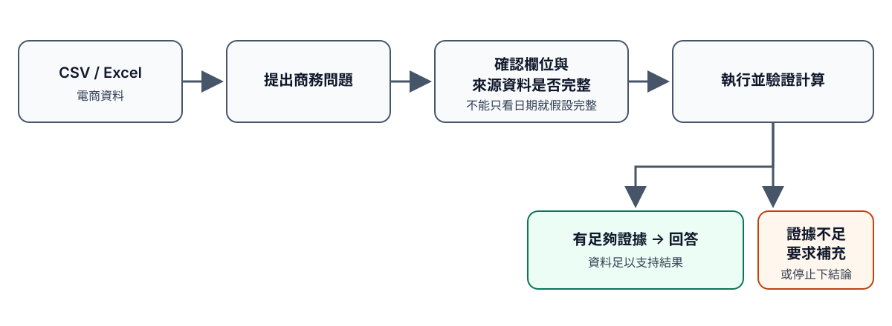
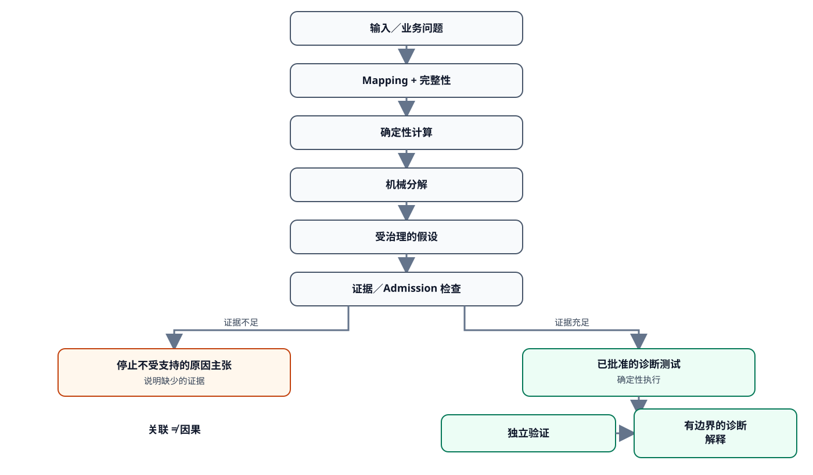

# CommerceLens

[English](#english) | [繁體中文](#traditional-chinese) | [简体中文](#simplified-chinese)

<a id="english"></a>

## English

CommerceLens is an open-source Codex plugin for analyzing commerce data in CSV and XLSX files. It calculates revenue, order count, average order value, and absolute revenue change. It shows what the data supports and refuses explanations when the evidence is not sufficient.

The installed public plugin supports descriptive analysis, product-level revenue decomposition, and one bounded product-mix diagnostic test.

<!-- fact: inputs=csv,xlsx -->
<!-- fact: metrics=revenue,orders,aov,absolute-revenue-change -->
<!-- fact: analytical-layers=descriptive,mechanical-decomposition,governed-diagnostic-testing -->
<!-- fact: diagnostic-scope=public-plugin,product_composition_association,weekly_product_presence_revenue_association@1.0.0 -->

> CommerceLens reports only conclusions supported by the available evidence. It does not invent missing causes.

### A simple example

**Synthetic example — not real merchant or customer data.**

> **Question:** Why did revenue decline from Q3 to Q4?
>
> **Current public-plugin response:** Revenue declined by 18%. When the file has enough complete weekly evidence, CommerceLens can test whether larger product-mix changes are consistently related to lower weekly revenue. A supported result is one possible explanation, not proof of cause.

The installed plugin can answer what changed and run the approved product-mix test when the evidence requirements are met.

### Why this is different from generic AI file analysis

CommerceLens uses deterministic calculations for material numbers and checks calculated results separately. Language-model reasoning does not replace execution evidence. A file with the right columns is not automatically complete: the workflow may ask whether all relevant pages, records, order statuses, and filters are included.

When evidence is missing or cannot be checked, CommerceLens says so instead of guessing.

### What is available now

| Capability | Status |
|---|---|
| Calculate revenue, count orders, calculate average order value (AOV), and compare absolute revenue change | Available in the installed public plugin |
| Read CSV/XLSX files and use a confirmed non-standard column mapping | Available in the installed public plugin |
| Break down how product-level changes contribute to the observed revenue change | Available in the installed public plugin |
| Suggest testable possible explanations based on the data | Available in the installed public plugin for the supported product-mix family |
| When enough evidence is available, test whether product-mix changes are consistently related to lower revenue | Available in the installed public plugin |
| When supported by the data, explain which possible reason currently has evidence behind it | Available in the installed public plugin with explicit non-causal limits |

<!-- fact: public-plugin=revenue,orders,aov,absolute-revenue-change,csv,xlsx,confirmed-mapping,mechanical-product-revenue-decomposition,governed-hypothesis-generation,one-product-composition-diagnostic,bounded-why-explanation -->
<!-- fact: repository-mvp=mechanical-product-revenue-decomposition,governed-hypothesis-generation,one-product-composition-diagnostic,bounded-why-explanation -->
<!-- fact: unavailable=causal,primary-or-sole-cause,general-root-cause,discount-diagnostic,inventory-diagnostic,external-market-diagnostic,forecasting,prescriptive,statistical-significance -->

Revenue means eligible merchandise value after discounts, excluding tax and shipping. It is not formal accounting revenue or cash received.

Orders means the number of distinct eligible orders.

Average order value (AOV) is revenue divided by orders for the same analysis population. If orders are zero, AOV is undefined rather than 0.

Absolute revenue change is comparison-period revenue minus baseline-period revenue.

### What CommerceLens still cannot conclude

| Limitation | Status |
|---|---|
| Prove causality | Not supported |
| Determine the sole or primary cause | Not supported |
| Analyze arbitrary causes such as discounting, inventory, or external markets | Not available yet |
| Forecast future revenue | Not supported |
| Recommend business actions | Not supported |
| Claim statistical significance | Not supported |
| Calculate revenue-change percentage or generic product/category rankings | Not supported by the installed public plugin |

### Install and quick start

```bash
codex --version
codex plugin marketplace add daniel-j-lin/commerce-lens
codex plugin add commerce-lens --marketplace commerce-lens
codex plugin list
```

Start a fresh Codex session, provide a CSV or XLSX file, and ask a descriptive question such as: “How did revenue change from Q3 2026 to Q4 2026?” CommerceLens asks for column-mapping or completeness details when needed, then calculates and validates the supported metric. See [Public usage](docs/USAGE.md).

### How the public diagnostic workflow works

The installed plugin uses the workflow below for the supported product-mix diagnostic.

```text
Business question
↓
Define the metric, scope, and periods
↓
Map the source columns and check completeness
↓
Calculate the metric
↓
Break down the numerical change where applicable
↓
Suggest a possible explanation
↓
Is there enough evidence?
├─ NO  → refuse the unsupported explanation → identify what is missing
└─ YES → test the supported explanation → independently check the result
        → explain what the data supports → state limits and other possible causes
```

**Association != causation.**

CommerceLens compares the set of products sold in each week with the baseline product set and measures how different the two sets are. This difference is calculated using Jaccard distance.

It then checks whether weeks with larger product-mix changes also tend to have lower revenue. It summarizes that pattern with a Spearman correlation value between -1 and +1. A negative value means that larger product-mix changes tend to appear together with lower revenue.

For the current MVP, CommerceLens treats rho <= -0.50 as the predefined support threshold. This is a product rule for this method, not a statistical-significance rule.

#### Synthetic repository/MVP diagnostic example

**Synthetic example — not real merchant or customer data.** The values come from the independently recomputed fixture `FX-R7-PROD-001A`, not from a production benchmark.

**What happened?**
Revenue declined by 18%.

**What did CommerceLens check?**
It checked whether weeks with bigger changes in product mix also tended to have lower revenue.

**What did it find?**
Across 8 valid weeks—4 baseline weeks and 4 comparison weeks—the relationship was strongly negative. Spearman rho = -1.0. The current support threshold is rho <= -0.50, so the test passed (system state: `CRITERION_MET`). The result was independently checked.

**What does that mean?**
Product mix is one possible explanation supported by the available data.

**What does it not mean?**
It does not prove that product mix caused the decline or that it was the only or primary reason. Seasonality, discounting, inventory, overall demand, promotions, customer mix, time trend, and external market conditions remain possible explanations.

Technical note: the repository method is `weekly_product_presence_revenue_association@1.0.0` for `product_composition_association`. It requires sufficient full-week data plus authenticated `product_id` and Revenue evidence. `CRITERION_MET` is not a `ClaimDecision` or a `Finding`.


### Reliability, data safety, and limitations

- Only one product-mix diagnostic method is available in the installed public plugin.
- The result is an observed relationship, not causal proof, a primary-cause determination, or a statistical-significance claim.
- The diagnostic method needs enough valid full weeks. It can be inconclusive when there are too few observations, product mix does not vary, revenue performance does not vary, or the correlation is undefined.
- The installed public plugin returns only the bounded product-mix explanation supported by the authenticated result.
- External validation is not established. Public examples and fixtures are synthetic.
- User-confirmed source completeness is recorded as `USER_DECLARED`; it is not independent verification.

Temporary execution is the default. Retention is opt-in. Operators can list, inspect, and verify a retained run:

```bash
python3.11 skills/commerce-lens/scripts/run_public_analysis.py --retention-root ROOT --list-retained
python3.11 skills/commerce-lens/scripts/run_public_analysis.py --retention-root ROOT --inspect-run RUN_ID
python3.11 skills/commerce-lens/scripts/run_public_analysis.py --retention-root ROOT --verify-run RUN_ID
```

A retained bundle reports `retained_complete` only after its integrity checks and completion marker succeed. Retained local data is plaintext with no TTL, encryption, or secure erase.

<!-- fact: retention=temporary-default,opt-in,list-inspect-verify,plaintext,no-ttl,no-encryption,no-secure-erase -->

### Release status and technical documentation

<!-- fact: release=v0.3.1,public,tag-v0.3.1 -->
<!-- fact: validation=p00-pass-internal,p01-not-run,p15-not-pass -->

- Current version and Git tag: `v0.3.1`. The GitHub release is public.
- P00: **PASS** — internal expert rehearsal with 0 external participants.
- P01 external first-user pilot: **NOT RUN**. P15: **NOT PASS**.

P00 is internal rehearsal evidence only. It is not external validation, usability proof, or production-readiness evidence. See the [P00 closeout](validation/p15/P00_INTERNAL_PROTOCOL_REHEARSAL_CLOSEOUT.md).

- [Public usage](docs/USAGE.md)
- [Development notes](docs/DEVELOPMENT.md)
- [Public examples](examples/public_v0_1/README.md)
- [R7 method authority](decisions/R7-001-first-diagnostic-method-authority.md)
- [v0.3.1 release notes](release-notes/v0.3.1.md)
- [v0.3.0 historical release notes](release-notes/v0.3.0.md)
- [v0.2.0 historical release notes](release-notes/v0.2.0.md)
- [MIT License](LICENSE)

The frozen specifications remain authoritative. This README explains the current public surface and repository/MVP capability without replacing those specifications.

---

<a id="traditional-chinese"></a>

## 繁體中文

CommerceLens 是一套開源 Codex 外掛程式，可分析 CSV 與 XLSX 格式的電商資料。它能計算營收、訂單數、平均客單價，以及兩個期間之間的絕對營收變化。系統只說明目前資料能支持的結論；證據不足時，不會猜測原因。

目前安裝後的公開外掛程式支援描述性分析、產品層級營收數值分解，以及一項有明確範圍限制的產品組合診斷測試。

<!-- fact: inputs=csv,xlsx -->
<!-- fact: metrics=revenue,orders,aov,absolute-revenue-change -->
<!-- fact: analytical-layers=descriptive,mechanical-decomposition,governed-diagnostic-testing -->
<!-- fact: diagnostic-scope=public-plugin,product_composition_association,weekly_product_presence_revenue_association@1.0.0 -->

> CommerceLens 只回報現有證據支持的結論，不會編造缺少的原因。

### 一個簡單範例

**合成資料範例，不是真實商家或客戶資料。**

> **問題：** 為什麼營收從第三季到第四季下降？
>
> **目前公開外掛程式的回答：** 營收下降了 18%。如果檔案包含足夠且完整的每週證據，CommerceLens 可以檢查產品組合變化較大的週是否持續伴隨較低營收。達到支持門檻只代表可能原因之一，不是因果證明。

安裝後的公開外掛程式可以回答「發生了什麼變化」，並在證據要求滿足時執行已核准的產品組合測試。

### 與一般 AI 檔案分析有什麼不同？

CommerceLens 會用固定、可重現的方式計算重要數字，並另外驗證計算結果。語言模型的推理不能取代實際執行與驗證。檔案有正確欄位，也不代表資料一定完整；系統可能會詢問相關頁面、紀錄、訂單狀態與篩選條件是否都已包含。

如果證據缺少或無法確認，CommerceLens 會清楚說明，而不是自行猜測。

### 目前可以使用的功能

| 功能 | 狀態 |
|---|---|
| 計算營收、訂單數、平均客單價（AOV），以及比較絕對營收變化 | 安裝後的公開外掛程式可用 |
| 讀取 CSV/XLSX 檔案，並使用經確認的非標準欄位對應 | 安裝後的公開外掛程式可用 |
| 適用時，分解不同產品對營收變化的數值影響 | 安裝後的公開外掛程式可用 |
| 根據資料提出可檢查的可能原因 | 安裝後的公開外掛程式可用，但只限支援的產品組合類型 |
| 證據足夠時，檢查產品組合變化是否與營收下降存在穩定關聯 | 安裝後的公開外掛程式可用 |
| 在資料足夠時，說明目前有哪些可能原因受到資料支持 | 安裝後的公開外掛程式可用，並會清楚說明非因果限制 |

<!-- fact: public-plugin=revenue,orders,aov,absolute-revenue-change,csv,xlsx,confirmed-mapping,mechanical-product-revenue-decomposition,governed-hypothesis-generation,one-product-composition-diagnostic,bounded-why-explanation -->
<!-- fact: repository-mvp=mechanical-product-revenue-decomposition,governed-hypothesis-generation,one-product-composition-diagnostic,bounded-why-explanation -->
<!-- fact: unavailable=causal,primary-or-sole-cause,general-root-cause,discount-diagnostic,inventory-diagnostic,external-market-diagnostic,forecasting,prescriptive,statistical-significance -->

營收是符合分析條件的商品價值，已計入折扣，但不包含稅金與運費。它不是會計上的正式營收，也不是實際收到的現金。

訂單數是符合條件的不重複訂單數量。

平均客單價（AOV）是同一分析範圍內的營收除以訂單數。如果訂單數為零，平均客單價會標示為「無法定義」，而不是 0。

絕對營收變化是比較期間的營收減去基準期間的營收。

### CommerceLens 目前不能下的結論

| 限制 | 狀態 |
|---|---|
| 判定真正的因果關係 | 不支援 |
| 判定唯一原因或主要原因 | 不支援 |
| 任意分析折扣、庫存、外部市場等原因 | 尚未提供 |
| 預測未來營收 | 不支援 |
| 直接提供經營建議 | 不支援 |
| 宣稱統計顯著 | 不支援 |
| 計算營收變化百分比，或提供一般產品／類別排名 | 安裝後的公開外掛程式不支援 |

### 安裝與快速開始

```bash
codex --version
codex plugin marketplace add daniel-j-lin/commerce-lens
codex plugin add commerce-lens --marketplace commerce-lens
codex plugin list
```

重新開啟 Codex 工作階段，提供 CSV 或 XLSX 檔案，並提出描述性問題，例如：「2026 年第三季到第四季的營收變化是多少？」如果需要，CommerceLens 會詢問欄位對應或資料完整性，再計算並驗證支援的指標。請參閱[公開使用說明](docs/USAGE.md)。

### 公開外掛程式的診斷流程

安裝後的公開外掛程式會以以下流程執行支援的產品組合診斷。

```text
商務問題
↓
定義指標、範圍與期間
↓
對應來源欄位並檢查資料完整性
↓
計算指標
↓
適用時，分解數值變化
↓
提出可能原因
↓
證據是否足夠？
├─ 否 → 拒絕沒有證據支持的解釋 → 說明缺少什麼
└─ 是 → 檢查有證據支持的可能原因 → 獨立驗證結果
        → 說明資料目前支持什麼 → 列出限制與其他可能原因
```

**有關聯不等於有因果關係。**

CommerceLens 會比較每週實際賣出的產品，和基準期間常見的產品組合有多大差異。這項差異以 Jaccard 距離計算。

接著，系統會檢查：產品組合變化較大的週，營收是否也通常比較低。系統會用 -1 到 +1 之間的 Spearman 相關係數來表示這種關係。數值越接近 -1，代表「產品組合變化越大時，營收通常越低」的趨勢越明顯。

目前 MVP 預先設定的支持門檻是 rho <= -0.50。這是 CommerceLens 對這項方法設定的判斷規則，不代表統計顯著。

#### repository/MVP 合成診斷範例

**這是合成資料，不是真實商家或客戶資料。** 數值來自經獨立重新計算的測試資料 `FX-R7-PROD-001A`，不是正式環境的效能基準。

**發生了什麼？**
營收下降了 18%。

**CommerceLens 檢查了什麼？**
系統檢查產品組合變化較大的週，營收是否也通常比較低。

**結果如何？**
在 8 個有效週期中（基準期間 4 週、比較期間 4 週），兩者呈現很明顯的負向關聯。Spearman rho = -1.0。目前設定的支持門檻是 rho <= -0.50，因此這項測試達到支持門檻（系統狀態：`CRITERION_MET`）。結果已經過獨立驗證。

**這代表什麼？**
目前資料支持「產品組合變化」是可能原因之一。

**這不代表什麼？**
這不能證明產品組合造成營收下降，也不能證明它是唯一或最主要的原因。季節性、折扣、庫存、整體需求、促銷、顧客組合、時間趨勢與外部市場狀況仍是其他可能原因。

技術說明：repository 方法是 `weekly_product_presence_revenue_association@1.0.0`，適用於 `product_composition_association`。它需要足夠的完整每週資料，以及經確認的 `product_id` 與 Revenue 證據。`CRITERION_MET` 不是 `ClaimDecision`，也不是 `Finding`。



### 可靠性、資料安全與限制

- 安裝後的公開外掛程式目前只提供一項產品組合診斷方法。
- 結果只表示觀察到的關聯，不是因果證明、主要原因判定或統計顯著性主張。
- 診斷方法需要足夠的有效完整週。如果週數不足、產品組合沒有變化、營收表現沒有變化，或無法計算相關係數，結果可能無法判定。
- 安裝後的公開外掛程式只會回傳經驗證結果支持、且有明確範圍限制的產品組合解釋。
- 尚未完成外部驗證；公開範例與測試資料都是合成資料。
- 使用者確認的來源完整性會記錄為 `USER_DECLARED`，不代表已經過獨立驗證。

預設不保留執行資料；如有需要，可選擇保留。操作人員可列出、檢視與驗證已保留的執行紀錄：

```bash
python3.11 skills/commerce-lens/scripts/run_public_analysis.py --retention-root ROOT --list-retained
python3.11 skills/commerce-lens/scripts/run_public_analysis.py --retention-root ROOT --inspect-run RUN_ID
python3.11 skills/commerce-lens/scripts/run_public_analysis.py --retention-root ROOT --verify-run RUN_ID
```

只有在完整性檢查與完成標記都成功後，保留資料才會回報 `retained_complete`。保留在本機的資料是明文，沒有自動刪除期限、加密或安全抹除功能。

<!-- fact: retention=temporary-default,opt-in,list-inspect-verify,plaintext,no-ttl,no-encryption,no-secure-erase -->

### 發布狀態與技術文件

<!-- fact: release=v0.3.1,public,tag-v0.3.1 -->
<!-- fact: validation=p00-pass-internal,p01-not-run,p15-not-pass -->

- 目前版本與 Git 標籤：`v0.3.1`。GitHub release 已公開。
- P00：**PASS**——內部專家演練，外部參與者為 0。
- P01 外部首批使用者測試：**NOT RUN**。P15：**NOT PASS**。

P00 只是內部演練證據，不是外部驗證、易用性證明或正式環境就緒證據。請參閱 [P00 結案文件](validation/p15/P00_INTERNAL_PROTOCOL_REHEARSAL_CLOSEOUT.md)。

- [公開使用說明](docs/USAGE.md)
- [開發說明](docs/DEVELOPMENT.md)
- [公開範例](examples/public_v0_1/README.md)
- [R7 方法技術依據](decisions/R7-001-first-diagnostic-method-authority.md)
- [v0.3.1 發布說明](release-notes/v0.3.1.md)
- [v0.3.0 歷史發布說明](release-notes/v0.3.0.md)
- [v0.2.0 歷史發布說明](release-notes/v0.2.0.md)
- [MIT 授權條款](LICENSE)

凍結規格仍是最終依據。本 README 只說明目前的公開功能與 repository/MVP 能力，不取代正式規格。

---

<a id="simplified-chinese"></a>

## 简体中文

CommerceLens 是一款开源 Codex 插件，可分析 CSV 和 XLSX 格式的电商数据。它能计算营收、订单数、平均客单价，以及两个期间之间的绝对营收变化。系统只说明当前数据能够支持的结论；证据不足时，不会猜测原因。

目前安装后的公开插件支持描述性分析、产品级营收数值分解，以及一项有明确范围限制的产品组合诊断测试。

<!-- fact: inputs=csv,xlsx -->
<!-- fact: metrics=revenue,orders,aov,absolute-revenue-change -->
<!-- fact: analytical-layers=descriptive,mechanical-decomposition,governed-diagnostic-testing -->
<!-- fact: diagnostic-scope=public-plugin,product_composition_association,weekly_product_presence_revenue_association@1.0.0 -->

> CommerceLens 只报告现有证据支持的结论，不会编造缺少的原因。

### 一个简单示例

**合成数据示例，不是真实商家或客户数据。**

> **问题：** 为什么营收从第三季度到第四季度下降？
>
> **当前公开插件的回答：** 营收下降了 18%。如果文件包含足够且完整的每周证据，CommerceLens 可以检查产品组合变化较大的周是否持续伴随较低营收。达到支持门槛只代表可能原因之一，不是因果证明。

安装后的公开插件可以回答“发生了什么变化”，并在证据要求满足时运行已经批准的产品组合测试。

### 与一般 AI 文件分析有什么不同？

CommerceLens 会用固定、可复现的方式计算重要数字，并单独验证计算结果。语言模型的推理不能替代实际执行和验证。文件有正确的字段，也不代表数据一定完整；系统可能会询问相关页面、记录、订单状态和筛选条件是否都已包含。

如果证据缺失或无法确认，CommerceLens 会明确说明，而不是自行猜测。

### 目前可以使用的功能

| 功能 | 状态 |
|---|---|
| 计算营收、订单数、平均客单价（AOV），以及比较绝对营收变化 | 安装后的公开插件可用 |
| 读取 CSV/XLSX 文件，并使用经过确认的非标准字段对应关系 | 安装后的公开插件可用 |
| 适用时，分解不同产品对营收变化的数值影响 | 安装后的公开插件可用 |
| 根据数据提出可以检查的可能原因 | 安装后的公开插件可用，但仅限支持的产品组合类型 |
| 证据足够时，检查产品组合变化是否与营收下降存在稳定关联 | 安装后的公开插件可用 |
| 在数据足够时，说明目前有哪些可能原因得到数据支持 | 安装后的公开插件可用，并会明确说明非因果限制 |

<!-- fact: public-plugin=revenue,orders,aov,absolute-revenue-change,csv,xlsx,confirmed-mapping,mechanical-product-revenue-decomposition,governed-hypothesis-generation,one-product-composition-diagnostic,bounded-why-explanation -->
<!-- fact: repository-mvp=mechanical-product-revenue-decomposition,governed-hypothesis-generation,one-product-composition-diagnostic,bounded-why-explanation -->
<!-- fact: unavailable=causal,primary-or-sole-cause,general-root-cause,discount-diagnostic,inventory-diagnostic,external-market-diagnostic,forecasting,prescriptive,statistical-significance -->

营收是符合分析条件的商品价值，已经计入折扣，但不包含税费和运费。它不是会计上的正式营收，也不是实际收到的现金。

订单数是符合条件的不重复订单数量。

平均客单价（AOV）是同一分析范围内的营收除以订单数。如果订单数为零，平均客单价会显示为“无法定义”，而不是 0。

绝对营收变化是比较期间的营收减去基准期间的营收。

### CommerceLens 目前不能得出的结论

| 限制 | 状态 |
|---|---|
| 判断真正的因果关系 | 不支持 |
| 判断唯一原因或主要原因 | 不支持 |
| 任意分析折扣、库存、外部市场等原因 | 尚未提供 |
| 预测未来营收 | 不支持 |
| 直接提供经营建议 | 不支持 |
| 声称统计显著 | 不支持 |
| 计算营收变化百分比，或提供一般产品／品类排名 | 安装后的公开插件不支持 |

### 安装和快速开始

```bash
codex --version
codex plugin marketplace add daniel-j-lin/commerce-lens
codex plugin add commerce-lens --marketplace commerce-lens
codex plugin list
```

重新启动 Codex 会话，提供 CSV 或 XLSX 文件，并提出描述性问题，例如：“2026 年第三季度到第四季度的营收变化是多少？”如果需要，CommerceLens 会询问字段对应关系或数据完整性，再计算并验证支持的指标。请参阅[公开使用说明](docs/USAGE.md)。

### 公开插件的诊断流程

安装后的公开插件会按以下流程运行支持的产品组合诊断。

```text
业务问题
↓
定义指标、范围和期间
↓
对应来源字段并检查数据完整性
↓
计算指标
↓
适用时，分解数值变化
↓
提出可能原因
↓
证据是否足够？
├─ 否 → 拒绝没有证据支持的解释 → 说明缺少什么
└─ 是 → 检查有证据支持的可能原因 → 独立验证结果
        → 说明数据目前支持什么 → 列出限制和其他可能原因
```

**有关联不等于有因果关系。**

CommerceLens 会比较每周实际卖出的产品，与基准期间常见的产品组合有多大差异。这项差异通过 Jaccard 距离计算。

接下来，系统会检查：产品组合变化较大的周，营收是否也通常更低。系统会用 -1 到 +1 之间的 Spearman 相关系数来表示这种关系。数值越接近 -1，代表“产品组合变化越大时，营收通常越低”的趋势越明显。

目前 MVP 预先设定的支持门槛是 rho <= -0.50。这是 CommerceLens 为这项方法设定的判断规则，不代表统计显著。

#### repository/MVP 合成诊断示例

**这是合成数据，不是真实商家或客户数据。** 数值来自经过独立重新计算的测试数据 `FX-R7-PROD-001A`，不是正式环境的性能基准。

**发生了什么？**
营收下降了 18%。

**CommerceLens 检查了什么？**
系统检查产品组合变化较大的周，营收是否也通常更低。

**结果如何？**
在 8 个有效周中（基准期间 4 周、比较期间 4 周），两者呈现很明显的负向关联。Spearman rho = -1.0。目前设定的支持门槛是 rho <= -0.50，因此这项测试达到了支持门槛（系统状态：`CRITERION_MET`）。结果已经过独立验证。

**这代表什么？**
目前数据支持“产品组合变化”是可能原因之一。

**这不代表什么？**
这不能证明产品组合导致营收下降，也不能证明它是唯一或最主要的原因。季节性、折扣、库存、整体需求、促销、客户组合、时间趋势和外部市场状况仍是其他可能原因。

技术说明：repository 方法是 `weekly_product_presence_revenue_association@1.0.0`，适用于 `product_composition_association`。它需要足够的完整每周数据，以及经过确认的 `product_id` 和 Revenue 证据。`CRITERION_MET` 不是 `ClaimDecision`，也不是 `Finding`。



### 可靠性、数据安全和限制

- 安装后的公开插件目前只提供一项产品组合诊断方法。
- 结果只表示观察到的关联，不是因果证明、主要原因判断或统计显著性声明。
- 诊断方法需要足够的有效完整周。如果周数不足、产品组合没有变化、营收表现没有变化，或无法计算相关系数，结果可能无法判断。
- 安装后的公开插件只会返回经过验证的结果所支持、且有明确范围限制的产品组合解释。
- 尚未完成外部验证；公开示例和测试数据都是合成数据。
- 用户确认的来源完整性会记录为 `USER_DECLARED`，不代表已经过独立验证。

默认不保留运行数据；如有需要，可以选择保留。操作人员可列出、查看和验证已经保留的运行记录：

```bash
python3.11 skills/commerce-lens/scripts/run_public_analysis.py --retention-root ROOT --list-retained
python3.11 skills/commerce-lens/scripts/run_public_analysis.py --retention-root ROOT --inspect-run RUN_ID
python3.11 skills/commerce-lens/scripts/run_public_analysis.py --retention-root ROOT --verify-run RUN_ID
```

只有在完整性检查和完成标记都成功后，保留数据才会报告 `retained_complete`。保留在本地的数据是明文，没有自动删除期限、加密或安全擦除功能。

<!-- fact: retention=temporary-default,opt-in,list-inspect-verify,plaintext,no-ttl,no-encryption,no-secure-erase -->

### 发布状态和技术文档

<!-- fact: release=v0.3.1,public,tag-v0.3.1 -->
<!-- fact: validation=p00-pass-internal,p01-not-run,p15-not-pass -->

- 当前版本和 Git 标签：`v0.3.1`。GitHub release 已公开。
- P00：**PASS**——内部专家演练，外部参与者为 0。
- P01 外部首批用户测试：**NOT RUN**。P15：**NOT PASS**。

P00 只是内部演练证据，不是外部验证、易用性证明或正式环境就绪证据。请参阅 [P00 结项文档](validation/p15/P00_INTERNAL_PROTOCOL_REHEARSAL_CLOSEOUT.md)。

- [公开使用说明](docs/USAGE.md)
- [开发说明](docs/DEVELOPMENT.md)
- [公开示例](examples/public_v0_1/README.md)
- [R7 方法技术依据](decisions/R7-001-first-diagnostic-method-authority.md)
- [v0.3.1 发布说明](release-notes/v0.3.1.md)
- [v0.3.0 历史发布说明](release-notes/v0.3.0.md)
- [v0.2.0 历史发布说明](release-notes/v0.2.0.md)
- [MIT 许可证](LICENSE)

冻结规范仍是最终依据。本 README 只说明当前的公开功能与 repository/MVP 能力，不会替代正式规范。
